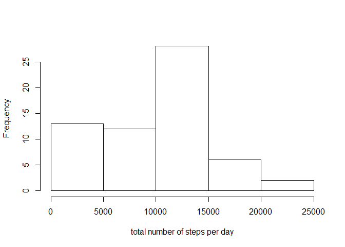
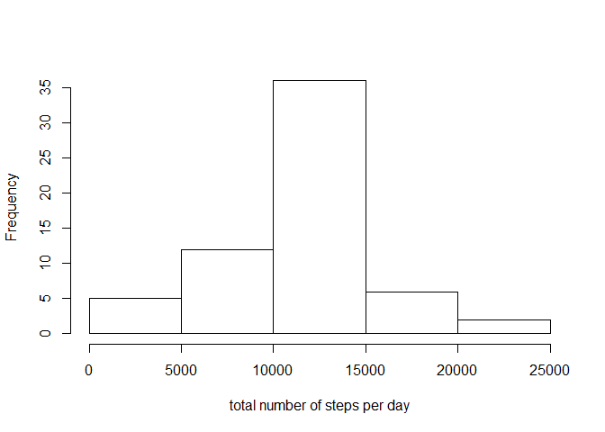

# Reproducible Research: Peer Assessment 1


## Loading and preprocessing the data  
Create dataframe from activity monitoring data.

```r
unzip("activity.zip")
dfsrc <- read.csv("activity.csv")
```

## What is mean total number of steps taken per day?
1. Create dataframe of total number of steps per day.

```r
library(dplyr)
dfperDay <- dfsrc %>% 
            group_by(date) %>% 
            summarise(steps = sum(steps,na.rm=TRUE)) %>% 
            select(date, steps)
```
2. Create histogram of total number of steps per day.

```r
hist(dfperDay$steps, 
     main="",
     xlab="total number of steps per day")
```

 

3. Calculate mean and median and report the same.

```r
Smean   <- as.character(round(mean(dfperDay$steps),2))
Smedian <- as.character(round(median(dfperDay$steps),2))
```
The mean of total number of steps taken per day is 9354.23.   
The median of total number of steps taken per day is 10395.

## What is the average daily activity pattern?
1. Create dataframe of average number of steps per interval.

```r
dfperInt <- dfsrc %>% 
            group_by(interval) %>% 
            summarise(steps = mean(steps,na.rm=TRUE)) %>% 
            select(interval, steps)
```
2. Make a time series plot (i.e. type = "l") of the 5-minute interval (x-axis) and the average number of steps taken, averaged across all days (y-axis).

```r
library(datasets)
with(dfperInt, plot(interval, steps, type='l'))
```

 

3. Which 5-minute interval, on average across all the days in the dataset, contains the maximum number of steps?

```r
# Get maximum steps
maxsteps <- dfperInt %>% 
            summarise(steps = max(steps,na.rm=TRUE)) %>% 
            select(steps)
# Get interval correponding to maximum steps
maxInt   <- dfperInt %>% 
            filter(steps == as.numeric(maxsteps)) %>% 
            select(interval)
maxIntV  <- maxInt$interval
```
The 5-minute interval with maximum average steps is 835.   

## Imputing missing values
1. Calculate and report the total number of missing values in the dataset

```r
missV <- length(which(is.na(dfsrc$steps)))
```
The total number of rows with NA's is 2304.  

2. Devise the following strategy for filling in all of the missing values in the dataset:
      Fill up missing values with mean of the corresponding 5-interval calculated across all days. This will be done by merging dataframe of original data with dataframe of average number of steps per interval.

```r
dfmerge  <- merge(dfsrc, dfperInt, by="interval")
```

3. Create a new dataset that is equal to the original dataset but with the missing data filled in.

```r
dffill   <- dfmerge %>% 
            mutate(steps = ifelse(is.na(steps.x),steps.y,steps.x)) %>% 
            select(interval, date, steps)
```

4. Create dataframe of total number of steps per day from new dataframe.

```r
library(dplyr)
dfperDayN <- dffill %>% 
            group_by(date) %>% 
            summarise(steps = sum(steps)) %>% 
            select(date, steps)
```

5. Create histogram of total number of steps per day from new dataframe.

```r
hist(dfperDayN$steps, 
     main="",
     xlab="total number of steps per day")
```

 

6. Calculate & report mean and median from new dataframe.

```r
SmeanN   <- as.character(round(mean(dfperDayN$steps),2))
SmedianN <- as.character(round(median(dfperDayN$steps),2))
```
The mean of total number of steps taken per day is 10766.19.   
The median of total number of steps taken per day is 10766.19.

7. What is the impact of imputing missing data on the estimates of the total daily number of steps?

```r
meanpct  <- round((as.numeric(SmeanN)-as.numeric(Smean))*100
            /as.numeric(Smean),2)
medianpct <- round((as.numeric(SmedianN)-as.numeric(Smedian))*100
             /as.numeric(Smedian),2)
```
The % mean change with imputing missing values is 15.09.   
The % median change with imputing missing values is 3.57.   

## Are there differences in activity patterns between weekdays and weekends?
1. Create a new factor variable in the dataset with two levels - "weekday" and "weekend" indicating whether a given date is a weekday or weekend day.

```r
dfdtype  <- dffill %>% 
            mutate(daytype = as.factor(ifelse(weekdays(as.Date(date)) %in% 
            c("Saturday","Sunday"),"Weekend","Weekday"))) %>% 
            group_by(interval, daytype) %>% 
            summarise(steps = mean(steps))
```
2. Make a panel plot containing a time series plot (i.e. type = "l") of the 5-minute interval (x-axis) and the average number of steps taken, averaged across all weekday days or weekend days (y-axis). 

```r
library(lattice)
xyplot(steps ~ interval | daytype, dfdtype, type='l', layout=c(1,2))
```

 
